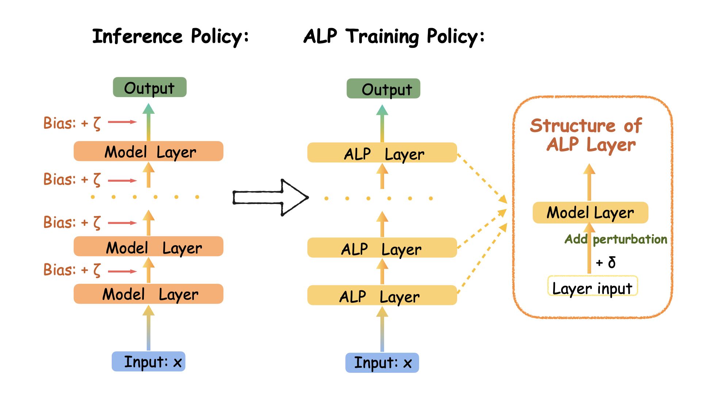

# Adaptive Layerwise Perturbation (ALP)

**Chenlu Ye\*, Xuanchang Zhang\*, Yifan Hao, Zhou Yu, Ziji Zhang, Abhinav Gullapalli, Hao Chen, Jing Huang, Tong Zhang**

University of Illinois Urbana-Champaign, Amazon

[](https://arxiv.org/abs/2603.19470) [](https://beneficial-curiosity-d98.notion.site/Adaptive-Layerwise-Perturbation-Unifying-Off-Policy-Corrections-for-LLM-RL-304bb76884bb80038347d7479272ad8e)

---

## Introduction

Policy staleness and training-inference mismatch are key challenges in LLM reinforcement learning. Modern RL pipelines use separate systems for rollout generation (e.g., BF16 vLLM) and policy training (e.g., FP32 FSDP), introducing distributional gaps between the behavior policy and the training policy. These gaps destabilize training through inflated importance sampling ratios and noisy gradient estimates.

**Adaptive Layerwise Perturbation (ALP)** addresses this by injecting learnable Gaussian perturbations into transformer hidden states across all layers during policy updates. The perturbed policy serves as the importance sampling numerator against the unperturbed inference policy. By flattening the policy landscape through noise injection, ALP naturally reduces IS ratio tail behavior and maintains training stability.

This repository contains experiments for both **multi-turn tool-integrated reasoning** and **single-turn RL** settings.

## Repository Structure

```
adaptive-layerwise-perturbation/
├── README.md                 # This file
├── multi-turn/               # Multi-turn tool-integrated reasoning experiments (Qwen2.5-7B)
│   ├── datasets/
│   ├── eval/
│   ├── figures/
│   ├── recipe/
│   ├── sandbox/
│   ├── scripts/
│   ├── sft/
│   └── ...
└── single-turn/              # Single-turn RL experiments (verl-based)
    ├── run_scripts/
    ├── scripts/
    └── ...
```

---

## Method

<p align="center">
  
</p>

This codebase implements four rollout-correction strategies for LLM-RL:

- **GSPO (Baseline):** Group-level sequence policy optimization with no mismatch correction. Standard clipped importance ratio at the token level.
- **Seq-Bypass:** Uses rollout (vLLM) log-probabilities directly as old_log_probs in the loss denominator, bypassing the reference policy evaluation.
- **MIS/TIS (Masked Importance Sampling):** Computes an auxiliary IS ratio between the FSDP training policy and the vLLM rollout policy. Outlier ratios are masked or truncated to stabilize training.
- **ALP (Adaptive Layerwise Perturbation):** Injects learnable Gaussian perturbations $\delta \sim \mathcal{N}(0, \sigma^2 I)$ into transformer hidden states across all layers during policy updates. The perturbed policy serves as the IS numerator. The learnable $\sigma$ is a scalar coefficient per layer.

---

## Results

### Multi-Turn Tool-Integrated Reasoning (Qwen2.5-7B)

<p align="center">
  
  
</p>

| Method | Average Score |
|--------|---------------|
| Seq-ALP | **50.53** |
| Token-ALP | 49.62 |
| Token-MIS | 48.74 |
| Seq-MIS | 46.94 |
| Seq-Bypass | 46.66 |
| GSPO (baseline) | 46.57 |

#### Ablation: Layer Range for ALP

| Layer Range | Score |
|-------------|-------|
| All layers (0-27) | **50.53** |
| Late layers (23-27) | 48.66 |
| Middle layers (12-17) | 48.51 |
| Early layers (0-5) | 48.25 |

All-layer perturbation substantially outperforms partial-layer variants, confirming that mismatch correction benefits from distributed noise across the full transformer stack.

---

## ALP Configuration

### Key Parameters

| Parameter | Config Key | Description | Default |
|-----------|-----------|-------------|---------|
| `USE_PERTURBATION` | `actor_rollout_ref.actor.use_perturbation` | Enable/disable ALP perturbation | `True` |
| `PERTURB_STD` | `actor_rollout_ref.actor.perturb_std` | Initial standard deviation $\sigma_0$ for Gaussian noise. The actual noise scale is $\exp(\log(\sigma_0))$, optimized in log-space to stay non-negative. | `1e-6` |
| `coef_learnable` | `coef_learnable` (in model `config.json`) | If `True`, the per-layer noise coefficient $\sigma_l$ is a learnable `nn.Parameter` updated via gradient descent. If `False`, $\sigma_l$ is fixed at `perturb_std`. | `True` |
| `PERTURB_LR` | `actor_rollout_ref.actor.perturb_lr` | Learning rate for the learnable perturbation coefficients (only used when `coef_learnable=True`) | `5e-4` |
| `PERTURB_START_LAYER` | `actor_rollout_ref.actor.perturb_start_layer` | Start layer index for perturbation (inclusive) | `0` |
| `PERTURB_END_LAYER` | `actor_rollout_ref.actor.perturb_end_layer` | End layer index for perturbation (exclusive). `null` means through the last layer. | `null` |
| `PERTURB_PATCH` | env `PERTURB_PATCH` | Transformer monkey-patch for noise injection. Options: `qwen2` (Qwen2/2.5), `qwen3`, `llama` (LLaMA 3.x) | `qwen2` |
| `LOSS_MODE` | `actor_rollout_ref.actor.policy_loss.loss_mode` | Loss aggregation: `token` (token-level ALP), `sequence` (sequence-level ALP), `vanilla`, `cum-token` | `sequence` |

### Enabling Learnable Coefficients

To use learnable perturbation coefficients, add these fields to the model's `config.json` before training:

```json
{
  "use_perturbation": true,
  "coef_learnable": true,
  "perturb_std": 1e-2
}
```

### Noise Seed Mechanism

The perturbation patch uses a **stateless seeded Generator** to ensure gradient-checkpointing correctness. Before every forward pass, a deterministic seed is set on each decoder layer (`layer._noise_seed`). During the forward pass, a local `torch.Generator` is created with `seed = _noise_seed + layer_idx`, producing identical noise on both the original forward and gradient-checkpoint recomputation. This guarantees correct gradients when `enable_gradient_checkpointing=True`.

For learnable coefficients, the noise injection is additionally wrapped in `torch.utils.checkpoint.checkpoint()` to avoid storing full-size noise activations while still computing gradients for the coefficient.

---

## Multi-Turn Experiments

Multi-turn training uses Qwen2.5-7B and requires a sandbox service for code execution during rollout, as the agent interleaves natural language reasoning with executable code.

See [`multi-turn/README.md`](multi-turn/README.md) for full details. Key highlights:

### Prerequisites

- 8 H100 GPUs recommended
- Docker with GPU support ([NVIDIA Container Toolkit](https://docs.nvidia.com/datacenter/cloud-native/container-toolkit/install-guide.html))
- Sandbox service for code execution

### Build and Start Container

```bash
cd multi-turn
docker build -t verl_sandbox -f docker/Dockerfile.simpletir .
```

### Start Sandbox Service

```bash
docker exec -d "$CONTAINER_NAME" bash -c \
  "cd /workspace/project/sandbox && uvicorn sandbox_api:app --host 0.0.0.0 --port 12345 --workers 8"
```

### Running Multi-Turn Experiments

```bash
bash train_gspo.sh                        # GSPO baseline
bash train_bypass.sh                      # Seq-Bypass
bash train_mis.sh                         # TIS/MIS
bash train_perturb.sh \
  --perturb_patch qwen2 \
  --loss_mode sequence \
  --perturb_std 1e-6 \
  --perturb_lr 5e-4 \
  --perturb_start_layer 0 \
  --perturb_end_layer null \
  --model_name Qwen2.5-7B \
  --max_turns 5 \
  --train_batch_size 128 \
  --clip_ratio_high 3.0 \
  --clip_ratio_low 0.5 \
  --train_dataset "simplelr_math_35/train deepscaler/train" \
  --valid_dataset "simplelr_math_35/test deepscaler/aime deepscaler/aime25"
```

### Multi-Turn Datasets

- [SimpleRL Math 3.5](https://huggingface.co/datasets/simplelr_math_35)
- [Deepscaler](https://huggingface.co/datasets/agentica-org/DeepScaleR)

### Multi-Turn Environment Variables

| Variable | Description | Default |
|----------|-------------|---------|
| `CUDA_VISIBLE_DEVICES` | GPU IDs (comma-separated) | Must be set |
| `DATA_PATH` | Directory containing dataset subdirs | `./datasets` |
| `CHECKPOINT_PATH` | Directory to save checkpoints | `./checkpoints` |
| `MODEL_DIR` | Parent directory for HF model checkpoints | `./models` |
| `MODEL_PATH` | HuggingFace org for model download | `Qwen` |
| `SANDBOX_ENDPOINT` | Sandbox API endpoint URL | `http://127.0.0.1:12345/faas/sandbox/` |
| `PROJECT_NAME` | Project name for experiment naming | `TIR` |
| `CONFIG_NAME` | Config file name (without extension) | `simpletir_trainer` |
| `WANDB_API_KEY` | WandB API key | Optional |
| `WANDB_ENTITY` | WandB entity | Optional |
| `RAY_TMPDIR` | Ray temp directory | Optional |

---

## Single-Turn Experiments

Single-turn RL experiments are based on `verl` and support multiple models and datasets.

See [`single-turn/README.md`](single-turn/README.md) for full details. Key highlights:

### Supported Models

- `qwen2.5-1.5b-math` → `Qwen/Qwen2.5-Math-1.5B`
- `qwen3-4b` → `Qwen/Qwen3-4B`

### Datasets

| Dataset | Source | Preparation Script |
|---------|--------|-------------------|
| OpenR1 (filtered) | `weqweasdas/from_default_filtered_openr1_with_scores` | `scripts/prepare_data_openr1.py` |
| Guru-RL-92k | `LLM360/guru-RL-92k` | `scripts/prepare_data_guru.py` |
| Merged OpenR1 + Guru | — | `scripts/merge_datasets.py` |

### Running Single-Turn Experiments

```bash
# Baseline
bash run_scripts/run_exp_baseline.sh [dataset] [model]

# Bypass
bash run_scripts/run_exp_bypass.sh [loss_mode] [dataset] [model]

# Perturbation (ALP)
bash run_scripts/run_exp_perturbation.sh [loss_mode] [perturb_std] [geometric] [dataset] [model]

# TIS
bash run_scripts/run_exp_tis.sh [level] [mode] [threshold] [veto_threshold] [dataset] [model]
```

### Quick Examples

```bash
bash run_scripts/run_exp_baseline.sh guru qwen2.5-1.5b-math
bash run_scripts/run_exp_bypass.sh sequence guru qwen3-4b
bash run_scripts/run_exp_perturbation.sh sequence 0.02 false openr1 qwen3-4b
bash run_scripts/run_exp_tis.sh sequence truncate 5.0 null guru qwen2.5-1.5b-math
```

### Single-Turn Environment Variables

`run_scripts/env_defaults.sh` provides defaults. You can override:

```bash
export PROJECT_ROOT=/path/to/repo
export DATA_ROOT=$PROJECT_ROOT/data
export CHECKPOINT_ROOT=$PROJECT_ROOT/checkpoints
export CACHE_ROOT=$PROJECT_ROOT/.cache

export WANDB_API_KEY=...
export WANDB_ENTITY=your_entity
export WANDB_MODE=online   # or offline
```

---

## Evaluation

### Single-Turn Evaluation

```bash
bash ./single-turn/eval_benchmark/eval_model_local.sh
```

### Multi-Turn Evaluation

Convert a trained checkpoint to HuggingFace format, then evaluate:

```bash
# Convert checkpoint
bash scripts/model_merger.sh

# Evaluate on AIME
MODEL_PATH=./models \
DATA_PATH=./datasets \
CHECKPOINT_PATH=./checkpoints \
LOG_PATH=./logs/TIR \
NNODES=1 \
GPUS_PER_NODE=8 \
RESUME=False \
CONFIG_NAME=simpletir_trainer \
bash train.sh \
  --max_response_length 12000 \
  --max_prompt_length 36000 \
  --model_name <MODEL_NAME> \
  --max_turns 10 \
  --valid_dataset "deepscaler/aime" \
  --val_only True \
  --n_val 32 \
  --output_acc_to_file True \
  --val_sample_size 500 \
  --sp_size 2
```

---

## Citation

If you find this work useful, please cite our paper:

```bibtex
@article{ye2025adaptive,
  title={Adaptive Layerwise Perturbation: Unifying Off-Policy Corrections for LLM Reinforcement Learning},
  author={Ye, Chenlu and Zhang, Xuanchang and Hao, Yifan and Yu, Zhou and Zhang, Ziji and Gullapalli, Abhinav and Chen, Hao and Huang, Jing and Zhang, Tong},
  journal={arXiv preprint arXiv:2603.19470},
  year={2025}
}
```

## Acknowledgement

The multi-turn codebase is built upon [SimpleTIR](https://github.com/ltzheng/SimpleTIR). We thank the SimpleTIR team for their multi-turn RL infrastructure. The single-turn experiments are based on [verl](https://github.com/volcengine/verl).

## Security

See [CONTRIBUTING](CONTRIBUTING.md#security-issue-notifications) for more information.

## License

This project is licensed under the Apache-2.0 License.
